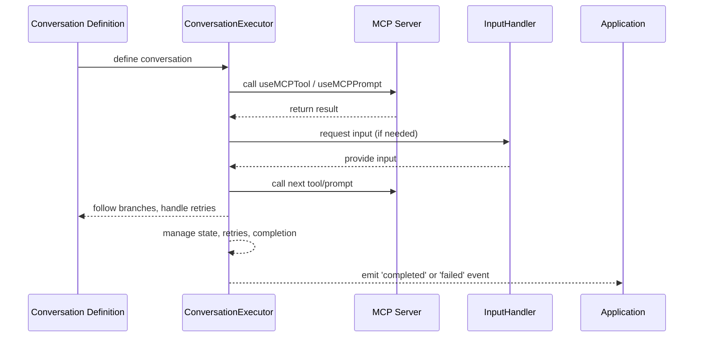
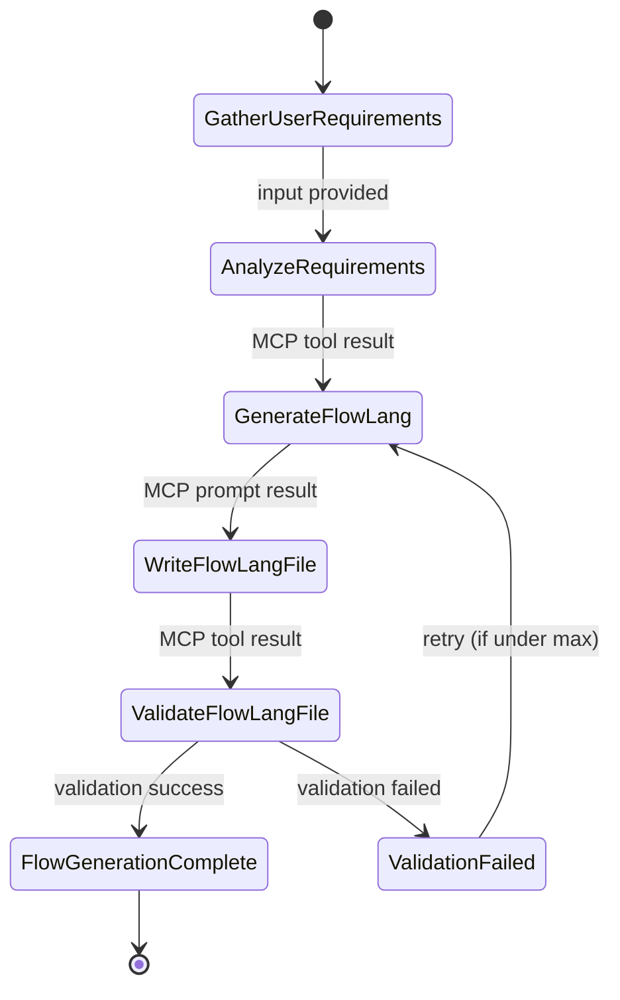

# Conversational AI Fluent API Design

## Overview

A fluent API for state-guided conversational AI using MCP servers.

## Core Concepts

### 1. Conversation Types
- **Human-to-AI**: Traditional chat interfaces with human input
- **AI-to-AI**: Backend orchestration between AI agents
- **Hybrid**: Mixed human and AI participants

### 2. Input Awareness
- **Known Input**: Structured data, predefined options
- **Unknown Input**: Free-form text, dynamic responses
- **Contextual Input**: Input that depends on conversation state

### 3. Flow Control
- **Sequential**: Linear conversation flow
- **Conditional**: Branching based on conditions
- **Iterative**: Loops and retries
- **Parallel**: Concurrent conversation threads
- **Error Handling**: Graceful failure recovery

## Fluent API Design

### Basic Structure

```typescript
// Core conversation builder
const conversation = new ConversationBuilder()
  .withMCPClient(mcpClient)
  .withMaxRetries(3)
  .withTimeout(30000);

// Conversation flow definition
const conversationFlow = conversation
  .start()
  .ask("What type of application do you want to build?")
  .expect("web-app" | "mobile-app" | "api")
  .then((appType) => 
    conversation
      .branch()
      .when(appType === "web-app", () => webAppFlow)
      .when(appType === "mobile-app", () => mobileAppFlow)
      .when(appType === "api", () => apiFlow)
      .otherwise(() => conversation.ask("Please specify a valid app type"))
  )
  .end();
```

### Flow Control Mechanisms

#### 1. Sequential Flow
```typescript
const sequentialFlow = conversation
  .start()
  .step("gather-requirements")
  .step("design-architecture")
  .step("generate-code")
  .step("test-implementation")
  .end();
```

#### 2. Conditional Branching
```typescript
const conditionalFlow = conversation
  .start()
  .ask("Do you need authentication?")
  .expect("yes" | "no")
  .branch()
    .when("yes", () => 
      conversation
        .step("setup-auth-provider")
        .step("configure-auth-routes")
    )
    .when("no", () => 
      conversation
        .step("skip-auth")
    )
  .merge()
  .step("continue-with-core-features")
  .end();
```

#### 3. Iterative Loops
```typescript
const iterativeFlow = conversation
  .start()
  .loop("add-features", {
    maxIterations: 10,
    condition: (state) => state.features.length < 5,
    body: () =>
      conversation
        .ask("What feature would you like to add?")
        .expect("string")
        .then((feature) => 
          conversation
            .step("add-feature", { feature })
            .ask("Add another feature?")
            .expect("yes" | "no")
        )
  })
  .end();
```

#### 4. Parallel Execution
```typescript
const parallelFlow = conversation
  .start()
  .parallel([
    () => conversation.step("setup-frontend"),
    () => conversation.step("setup-backend"),
    () => conversation.step("setup-database")
  ])
  .waitForAll()
  .step("integration-test")
  .end();
```

#### 5. Error Handling and Recovery
```typescript
const resilientFlow = conversation
  .start()
  .try(() =>
    conversation
      .step("risky-operation")
      .step("dependent-operation")
  )
  .catch((error) =>
    conversation
      .step("error-recovery", { error })
      .ask("Should we retry?")
      .expect("yes" | "no")
      .then((retry) => 
        retry === "yes" ? conversation.retry() : conversation.fail()
      )
  )
  .finally(() =>
    conversation.step("cleanup")
  )
  .end();
```

#### 6. Retry Mechanisms
```typescript
const retryFlow = conversation
  .start()
  .retry({
    maxAttempts: 3,
    backoff: "exponential", // linear, exponential, fixed
    baseDelay: 1000,
    maxDelay: 10000,
    retryCondition: (error) => error.isRetryable
  }, () =>
    conversation
      .step("unreliable-operation")
  )
  .end();
```

#### 7. Timeout and Cancellation
```typescript
const timeoutFlow = conversation
  .start()
  .timeout(30000, () =>
    conversation
      .step("long-running-operation")
  )
  .onTimeout(() =>
    conversation
      .step("handle-timeout")
      .ask("Continue with fallback?")
      .expect("yes" | "no")
  )
  .end();
```

### Advanced Flow Control

#### 1. State-Guided Navigation
```typescript
const stateGuidedFlow = conversation
  .start()
  .withState({
    currentStep: "requirements",
    progress: 0,
    decisions: {}
  })
  .step("requirements-gathering")
  .updateState((state) => ({
    ...state,
    currentStep: "design",
    progress: 25
  }))
  .whenState((state) => state.progress >= 25, () =>
    conversation.step("design-phase")
  )
  .end();
```

#### 2. Dynamic Flow Generation
```typescript
const dynamicFlow = conversation
  .start()
  .generateFlow((context) => {
    // AI generates flow based on context
    return conversation
      .step("analyze-requirements")
      .step("generate-architecture")
      .step("create-implementation");
  })
  .end();
```

#### 3. Conversation Composition
```typescript
const composedFlow = conversation
  .start()
  .compose([
    requirementsFlow,
    designFlow,
    implementationFlow
  ])
  .withTransitions([
    { from: "requirements", to: "design", condition: "requirements-complete" },
    { from: "design", to: "implementation", condition: "design-approved" }
  ])
  .end();
```

## MCP Integration

### Tool Calling
```typescript
const mcpFlow = conversation
  .start()
  .useMCPTool("getTodoItems", { userId: "123" })
  .then((todos) =>
    conversation
      .useMCPTool("createTodoItem", { 
        title: "Generated from conversation",
        userId: "123" 
      })
  )
  .end();
```

### Prompt Integration
```typescript
const promptFlow = conversation
  .start()
  .useMCPPrompt("manage-todos-dynamic", {
    context: { userId: "123", action: "create" }
  })
  .then((response) =>
    conversation
      .step("process-ai-response", { response })
  )
  .end();
```

## Concrete Domain Examples

### Example 1: Flow-Lang Generation Flow

> **Note:**
> In this flow, the AI agent is fully autonomous. It may call MCP tools in a loop, using the results of each tool call (such as validation failures) as feedback to decide whether to regenerate or retry. There is no human-in-the-loop; the process is driven entirely by the AI and tool responses. The global retry limit ensures the loop cannot run indefinitely.

```typescript
const conversationFlow = conversation
  .start()
  .withMaxRetries(3) // Global retry limit for the entire conversation
  .withContext({
    flowLangSpec: loadFlowLangSpecification(),
    samples: loadFlowLangSamples(),
    domainKnowledge: loadDomainKnowledge()
  })
  .step("gather-user-requirements", {
    type: "user-input",
    prompt: "What do you want to build today?",
    description: "Get initial user requirements for application generation"
  })
  .then((userInput) =>
    conversation
      .useMCPTool("analyzeRequirements", {
        description: userInput,
        context: conversation.context
      })
      .then((analysis) =>
        conversation
          .useMCPPrompt("generate-flow-lang", {
            requirements: analysis,
            flowLangSpec: conversation.context.flowLangSpec,
            samples: conversation.context.samples,
            domainKnowledge: conversation.context.domainKnowledge
          })
          .then((flowLangContent) =>
            conversation
              .useMCPTool("writeFlowLangFile", {
                filePath: `./flows/${analysis.projectName}.json`,
                content: flowLangContent
              })
              .then(() =>
                conversation
                  .useMCPTool("validateFlowLangFile", {
                    filePath: `./flows/${analysis.projectName}.json`
                  })
                  .then((validation) =>
                    conversation
                      .branch()
                      .when(validation.isValid, () =>
                        conversation
                          .step("flow-generation-complete", {
                            message: `Flow-lang file generated successfully: ${analysis.projectName}.json`,
                            nextStep: "scaffold-code"
                          })
                      )
                      .otherwise(() =>
                        conversation
                          .step("flow-validation-failed", {
                            errors: validation.errors,
                            action: "regenerate-flow"
                          })
                          .retry()
                      )
                  )
              )
          )
      )
  );
```

## Conversation Execution: From Definition to Runtime

Once you have defined a conversation using the fluent API, you need to execute it. This is handled by a ConversationExecutor, which interprets the conversation definition, manages state, calls MCP tools/prompts, and handles input and branching.

### Example: Executing a Conversation

```typescript
const conversationDefinition = flowLangGenerationFlow; // as defined above

const executor = new ConversationExecutor(conversationDefinition, {
  mcpClient: new MCPClient("ws://localhost:3000"),
  inputHandler: {
    "user-input": async (step) => {
      // In a fully automated system, this could be a system prompt or a pre-filled value
      return "I want to build a todo app";
    }
  }
});

executor.on('input-required', async (requirement) => {
  const input = await executor.inputHandler[requirement.type](requirement.step);
  await executor.session.provideInput(input);
});

executor.on('completed', (finalState) => {
  console.log("Conversation completed!", finalState);
});

executor.on('failed', (error) => {
  console.error("Conversation failed!", error);
});

await executor.start();
```

### How It Works
- The conversation definition is static and declarative.
- The ConversationExecutor is the runtime that interprets and runs the conversation.
- Input handlers provide data when needed (from a user, another AI, or a script).
- MCP integration is handled by the executor, which calls tools/prompts as defined.
- Branching, retries, and state are managed by the executor.
- Events allow the system to react to input requests, completions, and errors.

### Flow-Lang Generation Flow - Sequence diagram



### Flow-Lang Generation Flow - State diagram



### Summary
- **Conversation definition** is static and declarative.
- **ConversationExecutor** is the runtime that interprets and runs the conversation.
- **Input handlers** provide data when needed.
- **MCP integration** is handled by the executor, which calls tools/prompts as defined.
- **Branching, retries, and state** are managed by the executor.
- **Events** allow the system to react to input requests, completions, and errors.

This separation allows you to define complex conversational flows declaratively, and then execute them in a robust, event-driven, and fully automated way.

## Implementation Considerations

### 1. Flow Control Features
- **Max Conversation Retries**: Configurable retry limits per conversation
- **Timeout Handling**: Graceful timeout with fallback strategies
- **Error Recovery**: Automatic and manual error recovery mechanisms
- **State Persistence**: Save and restore conversation state
- **Progress Tracking**: Monitor conversation progress and completion

### 2. Performance Optimizations
- **Lazy Evaluation**: Only execute steps when needed
- **Caching**: Cache MCP tool results and AI responses
- **Parallelization**: Execute independent steps concurrently
- **Resource Management**: Efficient memory and connection usage

### 3. Monitoring and Debugging
- **Flow Visualization**: Visual representation of conversation flow
- **Step Logging**: Detailed logs for each conversation step
- **Performance Metrics**: Track execution time and resource usage
- **Error Reporting**: Comprehensive error reporting and analysis

### 4. Extensibility
- **Custom Flow Controls**: User-defined flow control mechanisms
- **Plugin System**: Extend functionality with plugins
- **Custom Validators**: Domain-specific input validation
- **Integration Hooks**: Connect with external systems and APIs

## Architecture Benefits

1. **Declarative**: Express conversation logic clearly and concisely
2. **Composable**: Build complex flows from simple components
3. **Testable**: Easy to unit test individual flow components
4. **Maintainable**: Clear separation of concerns and modular design
5. **Scalable**: Handle complex conversation patterns efficiently
6. **Type-Safe**: Full TypeScript support with compile-time validation
7. **Error-Resilient**: Built-in error handling and recovery mechanisms
8. **State-Aware**: Maintain conversation context and state throughout execution

This design provides a powerful foundation for building sophisticated conversational AI systems that can handle complex business logic, dynamic user interactions, and robust error scenarios while maintaining clean, readable code. 